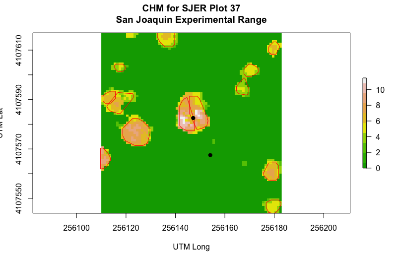

```{r setup, include=FALSE}
knitr::opts_chunk$set(echo = FALSE)
```


## Individual Tree Crown and using Spectrum and Water Indices for verificaton

- Find sites with inventories
- Find associated products.  
- Use CHM and crown metrics from individual trees.
  - run `package::itcSegment`
  - This is where we expect to see trees. 

## Concept
 - Validated canopy and estimated canopy from inventories
 - estimated canopy from ITC, what error are we seeing between the two?

 - extract spectra from points
 - calculate or extract indices (ndvi, water stress)

## What we accomplished

 - Functionalized most of the processes
 - Collaborated via GitHub
 - Learned techniques for estimating individual tree crowns
 - Started to extract spectral data from hdf5

## Gather inventory data

 - A library of functions for gathering site inventories
 
```{r eval=FALSE, echo=TRUE}
  source("scripts/load_data.R")
  # site name
  site <- "sjer"
  
  inventory <- loadSiteData(site = site, type = "structure")
  # View(inventory)
  
  # list of unique species at the site
  site_species <- listSpecies(inventory)
  site_species
  length(site_species)

```

## Functions for generating spatial points from inventories

```{r eval=FALSE, echo=TRUE}
# change the inventory data to a shape
coords_2_shape <- function(subPlotData, proj4Str){
  x <- subPlotData$easting
  y <-  subPlotData$northing
  # plotAttr <- dplyr::select(subPlotData, -c(easting, northing))
  coords <- as.data.frame(cbind(x,y))
  
  stemPoints <- SpatialPointsDataFrame(coords, 
                                       proj4string = CRS(proj4Str),
                                       data = data.frame(subPlotData))
  return(stemPoints)
}
```

## Buffer Site Centroids for use in ITC Model
 - We functionalized running bufferPoly()
 - Started to make it more adaptable to calculate individual tree max canopy diameters
```{r eval=FALSE, echo=TRUE}
  # read in the centroid polys
  ptShape <- readOGR("../NEONdata/D17-California/SJER/vector_data/", "SJER_plot_centroids")

# buffer the points to polygons with 20m radius
ptPoly <- bufferPoly(site, ptShape, 20)

```


## Generate Flightlines

```{r eval=FALSE, echo=TRUE}
  # use the buffer polygons to calculate intersecting flightlines
  plotPoly <- readOGR("output/", "SJER_20")
  # this code is Leah's
  goodFlightLines <-  find_intersect_h5(h5.files, plotPoly)

```

## Functions for working with hdf5
```{r eval=FALSE, echo=TRUE}

# select the first poly
plot1intersect <- find_intersect_h5(h5.files, plotPoly[1,])
# Visually inspected flight lines for most central
sub1 <- getSubset(plot1intersect[2], plotPoly[1,])

```

## Plot of ITC

```{r eval=FALSE, echo=TRUE}
source("scripts/extractRasterData.R")
source("scripts/load_data.R")
# site name
site <- "sjer"
  
inventory <- loadSiteData(site = site, type = "structure")

chm <- raster("../NEONdata/D17-California/SJER/2013/lidar/SJER_lidarCHM.tif")

ptShape <- readOGR("output/SJER/FIG/", "SJER37")

subPlotData <- inventory %>% filter(plotid == "SJER37")
subplotPts <- coords_2_shape(subPlotData,
                             proj4Str = ptShape@proj4string@projargs)

if(!extent(chm)==extent(ptShape)) {
  overlap <- intersect(extent(ptShape), extent(chm))
  chm1 <- raster::crop(chm, overlap)
}

```

***



```{r eval=FALSE, echo=FALSE}
plot(chm1, col=terrain.colors(10), 
     main="CHM for SJER Plot 37\nSan Joaquin Experimental Range",
     xlab = "UTM Long",
     ylab = "UTM Lat")
plot(ptShape, col=NA, border="red", add=TRUE)

points(subplotPts$easting,subplotPts$northing, pch=19, cex=1)

```


